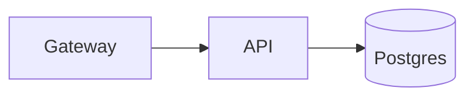

# Authoring Models

When you need more than hand-written Mermaid, choose the next layer carefully.

## Preferred order

1. plain Mermaid text
2. generated Mermaid from checked-in Node or TypeScript code
3. a thin DSL that compiles to Mermaid text

That order keeps the source reviewable and the abstraction pressure honest.

## 1. Plain Mermaid

Choose plain Mermaid when:

- there are only one or a few diagrams
- the domain vocabulary is still moving
- reviewers should be able to edit the diagram directly

Recommended file pattern:

- `docs/diagrams/<name>.mmd`
- `build/<name>.svg`

## 2. Generated Mermaid from Node code

Choose Node generation when:

- many diagrams share schema or layout rules
- the real source is structured data
- repetition makes direct Mermaid editing noisy

Recommended pattern:

- checked-in JSON, YAML, or TS object model
- checked-in generator script
- generated `.mmd`
- rendered artifact

Minimal example:

```js
const services = [
  ["Client", "Gateway"],
  ["Gateway", "API"],
  ["API", "Postgres"],
];

const lines = ["flowchart LR"];
for (const [from, to] of services) {
  lines.push(`  ${from} --> ${to}`);
}

process.stdout.write(`${lines.join("\n")}\n`);
```

Then:

```sh
node scripts/emit-system.mjs > docs/diagrams/system.mmd
mermaid render --input docs/diagrams/system.mmd --output build/system.svg
```

## 3. Thin DSL

Choose a DSL only when:

- the domain language is stable
- diagrams are numerous
- the same translation rules keep repeating
- the DSL is materially easier to review than raw Mermaid

Keep the DSL thin:

- compile to Mermaid text, not directly to SVG
- keep the compiler small and deterministic
- make the generated `.mmd` visible in review
- avoid hiding Mermaid concepts that reviewers still need to reason about

Example shape:

```text
system checkout
service gateway
service api
database postgres
gateway -> api
api -> postgres
```

Compiler output:



## Design test for a DSL

Before adding one, answer:

- what repeated author pain survives plain Mermaid?
- what repeated author pain survives a small generator script?
- does the DSL remove review burden instead of adding it?
- will reviewers still understand the generated Mermaid?

If those answers are weak, stay with plain Mermaid or a generator script.
