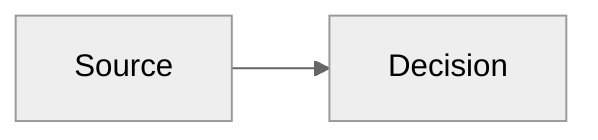
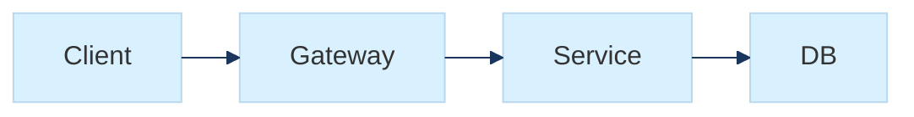
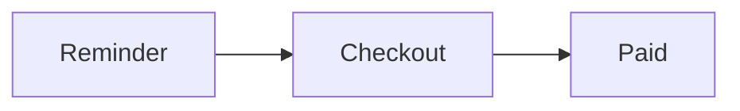

# Foundations

Official sources:

- Mermaid docs home: `https://mermaid.js.org/`
- syntax reference: `https://mermaid.js.org/intro/syntax-reference.html`
- theming: `https://mermaid.js.org/config/theming.html`
- accessibility: `https://mermaid.js.org/config/accessibility.html`

As of the current Mermaid docs surface, the official syntax families include:

- `flowchart`
- `sequenceDiagram`
- `classDiagram`
- `stateDiagram-v2`
- `erDiagram`
- `journey`
- `gantt`
- `pie`
- `quadrantChart`
- `requirementDiagram`
- `gitGraph`
- `C4Context` / other C4 forms
- `mindmap`
- `timeline`
- `zenuml`
- `sankey-beta`
- `xychart-beta`
- `block-beta`
- `packet-beta`
- `kanban`
- `architecture-beta`
- `radar-beta`
- `treemap-beta`
- `venn`
- `ishikawa`
- `tree`

Use the exact diagram declaration that the docs for that diagram family show. Some newer chart types are still beta-shaped in the syntax itself.

## Core syntax rules

- Every diagram starts with a diagram declaration.
- Line comments use `%%`.
- Frontmatter config goes at the top of the diagram and must be valid YAML.
- Unknown keywords or misspellings break diagrams.
- Mermaid is forgiving about many labels, but not forgiving about malformed structure.

Skeleton:

## Diagram breakers to remember

From the official docs:

- lowercase `end` can break some flowcharts and sequence diagrams; quote it or capitalize it
- avoid `{}` inside `%%` comments
- nested shape syntax inside labels can confuse the parser; quote labels when in doubt
- parameters can fail silently, so render before assuming a config key worked

## Frontmatter, looks, and layout

Frontmatter is the preferred diagram-local config surface.

Useful fields:

- `theme`: `default`, `neutral`, `dark`, `forest`, `base`
- `look`: `classic` or `handDrawn`
- `layout`: `dagre` or `elk`

Use `base` when you need custom theme variables. Use `neutral` for print-heavy or black-and-white contexts. Use `elk` when the graph is dense enough that the default layout becomes messy.

Example:

## Accessibility

The Mermaid docs recommend providing accessible title and description in the diagram text. Treat this as part of the source, not as afterthought metadata.

Pattern:

Use this when diagrams will land in docs, RFCs, knowledge bases, or customer-facing artifacts.

## Theme guidance

- Use `neutral` for formal docs and print.
- Use `base` plus `themeVariables` for brand-aligned artifacts.
- Keep custom colors hex-based; the Mermaid theming engine expects hex values.
- Prefer theme variables over ad hoc CSS when the goal is a reusable visual system.

## Source discipline

- Keep one conceptual diagram per file unless the document itself is the product.
- Use stable IDs and human-readable labels.
- Prefer short labels plus notes or legends over paragraph-sized nodes.
- Treat rendered outputs as generated artifacts; keep Mermaid text as the source of truth.
