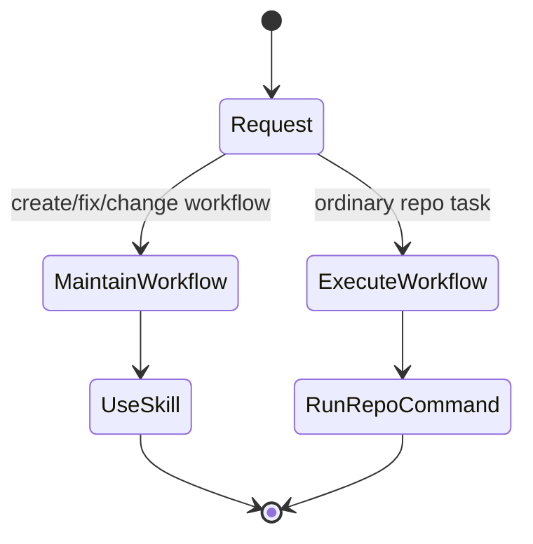

# Codex Source Of Truth

This document defines how `forge` acts as the first-party source of truth for Ian's Codex configuration.

The goal is not to absorb every local dotfile. The goal is to make the portable, durable parts of Codex behavior deterministic and reviewable in one repo.

## What Forge Owns

Forge should own portable Codex behavior such as:

- user-scoped skills that should be available everywhere
- router skills that help Codex choose the right narrower skill
- shared operating workflow skills such as `design-algorithm`
- high-signal policy and workflow guidance that should survive across machines and repos
- documented install and update flows for those assets

Forge should be the place where Ian defines:

- what Codex should know globally
- which portable skills should be available in user scope
- how skill routing should work
- how those assets are installed and updated deterministically

## What Forge Should Not Own

Forge should not become a dump for machine-local accident.

Keep these out of repo unless there is a clear abstraction boundary:

- secrets and tokens
- machine-specific paths and host details
- personal experiments that are not durable policy
- unrelated dotfiles that do not materially affect Codex behavior

## How Codex Knows Which Skill To Use

Codex skill selection should be treated as a product surface.

The main inputs are:

1. skill `description` frontmatter
2. explicit skill mentions such as `$forge-tools`
3. scope and install location
4. repo-local reinforcement such as `AGENTS.md`

### 1. Description Frontmatter

The `description` field is the primary implicit trigger surface.

For Forge-managed skills, descriptions should state:

- what the skill does
- when to use it
- what it should be preferred over
- when not to use it if confusion is likely

Descriptions should not be treated as incidental prose. They are part of the contract.

### 2. Explicit Mentions

Explicit mentions override ambiguity.

If the user or another skill names a skill directly, that is the strongest routing signal short of a hard conflict with the actual task.

### 3. Scope And Install Location

Portable user-scoped Forge skills belong in the Codex `USER` skill location:

```text
~/.agents/skills
```

That location is deterministic. Forge installs managed user-scope skills there by default via `forge skills install`.

Repo-local skills and repo `AGENTS.md` guidance are still useful, but they should reinforce user-scope behavior rather than replace it.

### 4. Repo-Local Reinforcement

`AGENTS.md` can strengthen routing inside a repo, but it is not the primary cross-repo trigger mechanism.

If a routing rule matters outside one checkout, it should usually become:

- a Forge-managed skill
- a documented policy in Forge
- or both

## Router Pattern

Forge should use router skills to keep routing explicit and compact.

Current pattern:

- `forge-tools` is the entry router for Forge-authored tools
- crate-specific skills such as `linear-cli`, `mermaid-diagrams`, `slack-query-cli`, and `slack-agent-cli` handle domain execution
- shared operating skills such as `design-algorithm` handle shaping and reduction work that crosses domains

Router skills should:

- point to the narrowest useful next skill
- explain the boundary between neighboring skills
- stay short
- avoid duplicating the full body of the skills they route to

## Workflow Maintenance vs. Workflow Execution

Forge should distinguish between skills that maintain a workflow and skills or commands that execute the workflow.

Examples:

- a repo-local skill such as `create-release-process` exists to define, audit, and repair the release process
- a repo-local skill such as `cut-release` can exist to execute the ordinary release by calling the checked-in runner
- the checked-in repo command `just cut-release` remains the deterministic runner that the execution skill should call

That distinction matters because Codex can otherwise misread a maintenance skill as the thing to run, or mis-handle an execution skill by reconstructing the shell flow instead of calling the deterministic repo task runner.

Decision rule:



For Forge releases, the intended mapping is:

- "change the release flow" -> use the repo-local `create-release-process` skill
- "cut the next release" -> use the repo-local `cut-release` skill, which should run `just cut-release` (often after `just cut-release --dry-run`)

## Trigger Contract For Forge Skills

Forge-managed skills should follow this trigger contract:

- the frontmatter `description` is the primary trigger contract
- the body should reinforce boundaries with concise "use this when" and "do not use this when" guidance when needed
- router skills should mention the skills they route to by name
- shared workflow skills should state the expected output shape, not just the philosophy

This is what makes skill routing deterministic enough to be maintained as a first-party system.

## Installation Model

If Forge is the source of truth, then portable Codex assets should be deployable through Forge rather than copied manually.

Current deployable surface:

- Forge-managed skills installed through `forge skills install`

Likely next candidates:

- documented templates for top-level Codex policy files
- generated or installable first-party Codex policy assets where the contract is stable

The boundary should stay narrow. Forge should manage Codex assets that are durable, portable, and worth versioning.

## Official Codex Surfaces

OpenAI's Codex docs treat these as first-class configuration surfaces:

- Config File
- Rules
- AGENTS.md
- Skills

The Skills docs define the deterministic `USER` skill location as `~/.agents/skills`. The Rules docs define user rules under `~/.codex/rules/`, with `~/.codex/rules/default.rules` as the user-layer file Codex writes when approvals are accepted in the UI.

This implies the main portable user-config surfaces Forge should reason about are:

- user skills
- user `AGENTS.md`
- user rules
- selected config templates or fragments

## GitHub Body File Pattern

Forge should treat GitHub CLI body handling as part of the portable user workflow baseline.

For GitHub work done through `gh`, the default for substantial issue bodies, pull request bodies, and markdown-heavy updates should be:

- write the body to a local markdown file
- pass that file with `--body-file` when the command supports it
- keep inline `--body` usage for short low-risk text only

Recommended patterns:

```sh
gh issue create --title "..." --body-file /tmp/issue.md
gh issue edit 123 --body-file /tmp/issue.md
gh pr create --title "..." --body-file /tmp/pr.md
gh pr edit 456 --body-file /tmp/pr.md
```

Reason:

- shell-interpolated multiline markdown is fragile
- backticks, `$HOME`-style paths, angle brackets, and fenced code blocks can trigger quoting problems or accidental shell behavior
- a local file is easier to review before submission and produces more deterministic Codex behavior

This is a workflow rule, not just a shell preference. If Forge is the source of truth for portable Codex behavior, this guidance belongs in the managed user baseline and related Forge docs.

## Current Local Files: Keep, Move, Or Fold

Based on the current local Codex directory, this is the recommended plan.

The important distinction is:

- source files you want to author and version in Forge
- installed runtime files Codex actually consumes from standard locations

Do not mirror the entire `~/.codex/` tree into Forge.

### Move Into Forge As First-Party Sources

These are durable enough to belong in repo as managed source material:

- `~/.codex/agents.md`
- `~/.codex/rules/user-policy.rules`
- selected user-scoped skills already managed under `<forge-repo>/.agents/skills/`

Recommended repo shape:

- a repo-managed user `AGENTS.md` template or installable asset
- a repo-managed user rules template or installable asset
- Forge-managed skills as the deployable user-scope skill layer

### Fold Into A Smaller Managed Surface

These local files look like content, not canonical runtime surfaces:

- `~/.codex/principles.md`
- `~/.codex/soul.md`

Recommendation:

- do not keep them as separate runtime files
- preserve them only as Forge authoring fragments when they still add value

Reason:

- they overlap with voice, working style, and decision heuristics already better expressed in `AGENTS.md`
- keeping them separate creates more drift without giving Codex a clearer documented contract

### Keep Local Or Private

These should stay out of Forge-managed source-of-truth scope:

- `~/.codex/auth.json`
- `~/.codex/installation_id`
- `~/.codex/history.jsonl`
- `~/.codex/session_index.jsonl`
- `~/.codex/sessions/`
- `~/.codex/archived_sessions/`
- `~/.codex/log/`
- `~/.codex/logs_2.sqlite*`
- `~/.codex/state_5.sqlite*`
- `~/.codex/cache/`
- `~/.codex/plugins/cache/`
- `~/.codex/vendor_imports/`
- backups such as `*.backup.*` and `*.bak`

These are either secrets, caches, machine-local state, or generated artifacts.

### Keep Mostly Local, But Define Templates In Forge

`~/.codex/config.toml` should usually not be copied into Forge verbatim.

Your current file mixes:

- portable defaults such as model, reasoning effort, and personality
- machine-local trust entries
- connector-specific approval state
- local installation details

Recommendation:

- keep the live `config.toml` local
- define a documented Forge-owned template or fragment set for the portable parts
- do not put machine-specific trust entries or connector IDs into the repo

Good candidates for a Forge-owned config template:

- preferred default model
- preferred default reasoning effort
- stable plugin enablement that is not machine-specific

Bad candidates:

- per-path trust levels
- connector installation IDs
- generated approval history
- local-only environment assumptions

## Proposed Repo Layout For User Config

If Forge expands beyond skills, the next clean shape is:

- keep skill sources in `<forge-repo>/.agents/skills/`
- add a dedicated repo area for first-party Codex user config sources

Suggested shape:

```text
codex/
  user/
    AGENTS.md
    rules/
      user-policy.rules
    config/
      config.toml.example
      config.portable.toml
    fragments/
      principles.md
```

Use this directory as source material, not as the live installed location.

Deployment model:

- install skills to `~/.agents/skills`
- render, diff, and install `AGENTS.md` to `~/.codex/AGENTS.md` with `forge codex`
- render, diff, and install user rules to `~/.codex/rules/` with `forge codex`
- keep live machine-specific config local, with optional Forge-generated fragments

Recommended interpretation:

- `codex/user/AGENTS.md` is the runtime target source
- `codex/user/fragments/` is optional authoring input and not part of the runtime contract
- `codex/user/config/` is templates and portable fragments, not a promise to fully own the live local config

## Better Than A Raw Dotfiles Mirror

Your current dotfiles layout is a useful historical input, but Forge should probably improve on it rather than copy it exactly.

The dotfiles pattern:

- `agents.md`
- `principles.md`
- `soul.md`
- `config.toml`
- `rules/user-policy.rules`

is understandable as an authoring system, but the official Codex surfaces are narrower. My recommendation is:

- keep `AGENTS.md`, rules, and skills as the main managed Codex runtime surfaces
- treat `principles.md` as an optional source input, not a required runtime file
- treat `config.toml` as template-driven and only partially managed

That gives you a cleaner contract:

- fewer runtime files
- less drift
- closer alignment with the documented Codex model
- still enough room to preserve your preferred voice and heuristics upstream in Forge

## Skill Metadata Opportunity

The Codex Skills docs also support optional `agents/openai.yaml` metadata, including:

- display metadata
- dependency declarations
- `allow_implicit_invocation`

That suggests another useful refinement for Forge-managed skills:

- add `agents/openai.yaml` to the skills where UI metadata or invocation policy materially improves routing
- consider setting `allow_implicit_invocation: false` on skills that should only run by explicit mention or router handoff

This is likely better than overloading `AGENTS.md` with all routing nuance.

## Render And Install Model

Forge now implements the v1 explicit render/apply semantics rather than direct blind copying.

Preferred workflow:

- `forge codex render` to show the rendered user-scoped Codex assets from Forge-owned sources
- `forge codex diff` to compare rendered output with the live local files
- `forge codex install` to apply the rendered output explicitly

Design constraints:

- no silent overwrite of live local Codex files
- preview and diff should be cheap
- apply should be explicit
- machine-local config stays local unless the user chooses to merge a portable fragment

This supports speed and low prompt count without broadening destructive defaults.

### Current V1 Boundary

`forge codex` manages only:

- `~/.codex/AGENTS.md`
- `~/.codex/rules/user-policy.rules`

It does not manage:

- live `~/.codex/config.toml`
- auth and installation files
- session history, caches, or plugin state
- profile or character switching

Target model:

- `user` means `~/.codex`
- `path:<abs-path>` exists for deterministic testing and explicit non-default installs

Source model:

- repo checkout when Forge is running from a repo and `codex/user/` is available
- embedded release payload otherwise

## Recommended Next Steps

1. Use the v1 render/diff/install workflow in practice and tighten the baseline only where real usage shows friction.
2. Keep `principles.md` as an authoring input only, not as a separate runtime file.
3. Keep the portable config template narrow unless a clearly stable merge contract emerges.
4. Evaluate `agents/openai.yaml` for the Forge-managed skills where invocation policy or dependencies would improve determinism.
5. Revisit broader deployment behavior only after the explicit v1 workflow has proven stable.

## Acceptance Test For Putting Something In Forge

Move a Codex behavior or asset into Forge when it is:

- portable across machines or repos
- durable enough to version
- high-signal for Codex behavior
- not secret or machine-local
- worth installing or updating deterministically

Keep it out of Forge when it is:

- private
- machine-specific
- experimental noise
- easier to express as a local one-off than as a maintained contract
