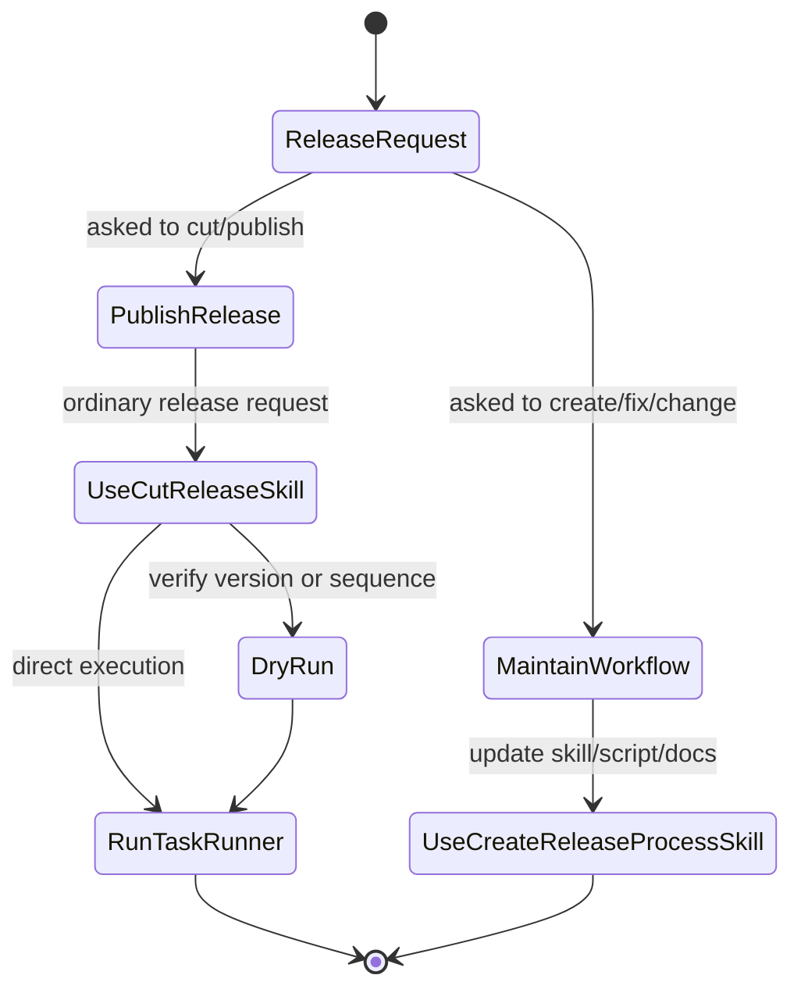

# Release Workflow

This document defines the current Forge release process.

## Current Process

Prefer the `just` entrypoint for normal release work:

```sh
just cut-release
```

The underlying checked-in script remains the source of truth:

```sh
./scripts/cut-release.sh
```

Optional flags:

```sh
just cut-release --version 20260415.0.1
just cut-release --dry-run
just cut-release --print-current-version
just cut-release --print-next-version
./scripts/cut-release.sh --version 20260415.0.1
./scripts/cut-release.sh --notes-file notes.md
./scripts/cut-release.sh --dry-run
./scripts/cut-release.sh --print-current-version
./scripts/cut-release.sh --print-next-version
```

Read-only version query:

```sh
just cut-release --print-current-version
just cut-release --print-next-version
```

- `--print-current-version` prints the current workspace release version from `crates/forge/Cargo.toml` and exits.
- `--print-next-version` fetches `main` and tags from `origin`, prints the next Phoenix-date CalVer, and exits.

Both read-only modes skip the clean-tree check and do not run the release steps.

For agent work in this repo, distinguish between maintaining the workflow and executing it:

- use the Forge-managed `create-release-process` skill when you are establishing, auditing, or changing the release process itself
- use the Forge-managed `cut-release` skill for an ordinary request to publish the next Forge release
- the `cut-release` skill should execute `just cut-release` (often after `just cut-release --dry-run`) rather than reconstructing the release by hand
- the deployed release-process skills are portable; this repo's `AGENTS.md`, this document, `just cut-release`, and `scripts/cut-release.sh` tailor Forge-specific Phoenix-date CalVer, release notes, validation, and GitHub release behavior
- only reconstruct the flow manually when you are explicitly correcting an already-published release

Decision rule:



Recommended sequence:

```sh
just cut-release --dry-run
just cut-release
```

The script currently enforces:

- branch must be `main`
- working tree must be clean
- local `main` must include `origin/main`
- version format must match `YYYYMMDD.0.N`
- `--print-current-version` prints the current workspace release version and exits without mutating the repo
- omitted `--version` resolves the next Phoenix-date CalVer automatically after fetching `main` and tags from `origin`
- `--print-next-version` prints that inferred next version and exits without mutating the repo
- version bumping happens through `just bump-version`
- `cargo check` must pass and the release commit must include `Cargo.lock`
- release diff must be limited to `Cargo.lock` and all workspace crate manifests under `crates/*/Cargo.toml`
- the script commits, pushes `main`, and creates the GitHub release

After the release is published, GitHub Actions builds and uploads the supported release artifacts plus verification metadata.

The underlying GitHub release step still uses GitHub CLI.

Recommended sequence:

```sh
just cut-release --dry-run
just cut-release
```
Shell note:

- the script keeps the `gh release create` invocation on one command line, which avoids the zsh split-command footgun

Why:

- the release sequence is now repetitive enough that the safe path should be the obvious path
- GitHub CLI still provides the final release surface
- the repo does not need a dedicated Rust release crate yet

## Version Source Of Truth

Release tags should match the crate version policy:

- format: `YYYYMMDD.0.N`
- example: `20260410.0.0`
- release dates are based on `America/Phoenix`

The release tag should match the versions in all workspace crate manifests under `crates/*/Cargo.toml`, including `crates/slack-core/Cargo.toml`.

## Future `forge release cut`

Target command shape:

```sh
forge release cut
forge release cut --version 20260410.0.1
forge release cut --dry-run
forge release cut --notes-file notes.md
```

Target behavior:

1. Verify git state
2. Verify versions match
3. Run release checks
4. Push `main`
5. Create the GitHub release

### 1. Verify git state

- ensure branch is `main` unless explicitly overridden
- ensure working tree is clean
- ensure local branch is not behind remote

### 2. Verify versions match

- read crate versions from relevant `Cargo.toml` files
- ensure all release-participating crates match
- ensure the requested release tag matches those versions

### 3. Run release checks

Initial default:

```sh
cargo check
```

## User Install And Update Story

The current user-facing release bootstrap path is GitHub-only: the fast verified artifact path requires local GitHub CLI attestation support, and the secure fallback is a tagged source build with `--locked` (if `gh attestation verify` is missing/unsupported, installer artifact path is disabled and source build is the only path).

New machine install:

```sh
curl -fsSL https://raw.githubusercontent.com/iancleary/forge/main/scripts/install-forge-release.sh | sh
```

That script:

- resolves the latest published Forge release tag by default
- re-executes the installer script from the exact tag it is about to install
- uses a verified platform release artifact only when local attestation verification is available
- supports `--attestation-failure prompt|source|fail` (default: `prompt`)
- verifies artifact SHA-256 before install
- falls back to a tagged source build with `--locked` when the verified artifact path is unavailable
- installs Forge-managed skills into `~/.agents/skills`
- installs the managed Codex baseline into `~/.codex/`

Deterministic install:

```sh
curl -fsSL https://raw.githubusercontent.com/iancleary/forge/20260413.0.0/scripts/install-forge-release.sh | sh -s -- --tag 20260413.0.0
```

Update story:

- use the installer script for first install and recovery
- use `forge self update-check` and `forge self update` as the steady-state release update path
- in release mode, that path checks the latest repo tag and uses an attested platform artifact only when local attestation verification is available
- in release mode, `forge self update --build-from-source` forces the tagged source-build path
- in release mode, missing or unsupported platform artifacts fall back to a tagged source build with `--locked`
- in release mode, missing local attestation verification (including missing/unsupported `gh attestation verify`) also falls back to a tagged source build with `--locked`
- `forge self update --attestation-failure <prompt|source|fail>` controls attestation failure behavior:
  - `prompt` (default): prompt in interactive mode, fallback in non-interactive
  - `source`: always fallback to tagged source
  - `fail`: abort when attestation fails
- checksum mismatch is a hard failure; do not silently fall back after verification failure
- attestation verification failure prompts to continue with a tagged source fallback (or falls back automatically when non-interactive)
- in release mode, `config/release-tools.toml` is the source of truth for current and legacy tool binary/config-dir names used during local migration and cleanup
- in release mode, `config/release-skills.toml` is the source of truth for current and legacy managed skill names used during local skill migration
- after upgrade, it reconciles Forge-managed skills and reapplies the managed Codex baseline

Forge now publishes a curated set of platform release artifacts plus:

- `forge-release-manifest.json`
- `forge-release-sha256sums.txt`
- per-artifact provenance bundles as `*.attestation.json`

This is still intentionally narrower than native package-manager formulas or a fully generalized release service.

## Maintaining The Installer Binary List

Forge keeps a manual, deterministic list of binaries to install embedded in `scripts/install-forge-release.sh`.

When adding/removing CLIs, update that list and run:

```sh
just install-list-check
```

This check fails if a binary crate exists under `crates/*/src/main.rs` but is not listed in the installer.

## Verifying Release Assets

Forge release assets now publish GitHub artifact attestations in addition to raw checksums.

Recommended online verification for a downloaded archive (strict path):

```sh
gh attestation verify ./forge-20260415.0.2-aarch64-apple-darwin.tar.gz \
  --repo iancleary/forge \
  --source-ref refs/tags/20260415.0.2 \
  --signer-workflow iancleary/forge/.github/workflows/release-artifacts.yml \
  --predicate-type https://slsa.dev/provenance/v1
```

That verification path uses the published GitHub attestation associated with the release asset and checks that the asset matches the release provenance.

For offline workflows, the release also publishes `*.attestation.json` bundle files that correspond to the built artifacts and release metadata.

## Maintaining The Release Tool Contract

Forge also keeps a release-scoped tool contract in `config/release-tools.toml`.

Update it when:

- adding or removing a managed CLI binary
- renaming a binary that should be removed from `~/.cargo/bin`
- renaming a tool config dir under `~/.config/forge`
- deprecating a root Forge config file that `forge self update` should remove

This file should declare only explicit, deterministic migrations. Do not infer renames in code.

## Maintaining The Release Skill Contract

Forge also keeps a release-scoped skill contract in `config/release-skills.toml`.

Update it when:

- adding or removing a Forge-managed release skill
- renaming a managed skill directory under `.agents/skills`
- preserving a legacy managed skill name that should migrate during `forge self update`

This file should declare only explicit, deterministic migrations. Do not infer skill renames in code.

### 4. Push `main`

Push before creating the release:

```sh
git push origin main
```

### 5. Create the release

Use GitHub CLI under the hood:

```sh
gh release create <version> --target main --title <version> --generate-notes --latest
```

## Suggested Flags

- `--version <v>`
- `--print-current-version`
- `--print-next-version`
- `--dry-run`
- `--notes-file <path>`
- `--no-check`
- `--target <branch>`
- `--not-latest`

## Out Of Scope For Now

- crates.io publishing
- automatic branch merging
- broad target coverage beyond the curated release matrix
- a second non-GitHub-native trust path such as Sigstore verification in the installer
