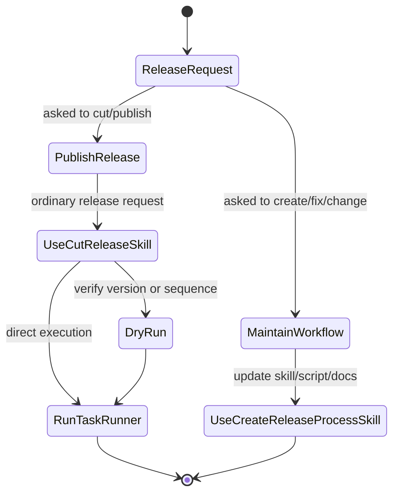

# Release Workflow

This document defines the current Forge release process.

## Current Process

Prefer the `just` entrypoint for normal release work:

```sh
just cut-release
```

The underlying checked-in script remains the source of truth:

```sh
./scripts/cut-release.sh
```

Optional flags:

```sh
just cut-release --version 20260415.0.1
just cut-release --dry-run
just cut-release --print-current-version
just cut-release --print-next-version
./scripts/cut-release.sh --version 20260415.0.1
./scripts/cut-release.sh --notes-file notes.md
./scripts/cut-release.sh --dry-run
./scripts/cut-release.sh --print-current-version
./scripts/cut-release.sh --print-next-version
```

Read-only version query:

```sh
just cut-release --print-current-version
just cut-release --print-next-version
```

- `--print-current-version` prints the current workspace release version from `crates/forge/Cargo.toml` and exits.
- `--print-next-version` fetches `main` and tags from `origin`, prints the next Phoenix-date CalVer, and exits.

Both read-only modes skip the clean-tree check and do not run the release steps.

For agent work in this repo, distinguish between maintaining the workflow and executing it:

- use the Forge-managed `create-release-process` skill when you are establishing, auditing, or changing the release process itself
- use the Forge-managed `cut-release` skill for an ordinary request to publish the next Forge release
- the `cut-release` skill should execute `just cut-release` (often after `just cut-release --dry-run`) rather than reconstructing the release by hand
- the deployed release-process skills are portable; this repo's `AGENTS.md`, this document, `just cut-release`, and `scripts/cut-release.sh` tailor Forge-specific Phoenix-date CalVer, release notes, validation, and GitHub release behavior
- only reconstruct the flow manually when you are explicitly correcting an already-published release

Decision rule:


```mermaid
stateDiagram-v2
    [*] --> ReleaseRequest
    ReleaseRequest --> MaintainWorkflow: asked to create/fix/change
    ReleaseRequest --> PublishRelease: asked to cut/publish
    MaintainWorkflow --> UseCreateReleaseProcessSkill: update skill/script/docs
    PublishRelease --> UseCutReleaseSkill: ordinary release request
    UseCutReleaseSkill --> DryRun: verify version or sequence
    UseCutReleaseSkill --> RunTaskRunner: direct execution
    DryRun --> RunTaskRunner
    RunTaskRunner --> [*]
    UseCreateReleaseProcessSkill --> [*]
```

Recommended sequence:

```sh
just cut-release --dry-run
just cut-release
```

The script currently enforces:

- branch must be `main`
- working tree must be clean
- local `main` must include `origin/main`
- version format must match `YYYYMMDD.0.N`
- `--print-current-version` prints the current workspace release version and exits without mutating the repo
- omitted `--version` resolves the next Phoenix-date CalVer automatically after fetching `main` and tags from `origin`
- `--print-next-version` prints that inferred next version and exits without mutating the repo
- version bumping happens through `just bump-version`
- if the version is already present on a clean `main` but has no tag or GitHub release, rerunning the same command resumes the unpublished release instead of creating another bump commit
- the full `just ci` contributor suite must pass locally and in the release workflow
- the release commit must include `Cargo.lock`
- release diff must be limited to `Cargo.lock` and all workspace crate manifests under `crates/*/Cargo.toml`
- the script commits and pushes `main`, dispatches `.github/workflows/release-artifacts.yml`, and waits for the workflow result
- the workflow builds every supported platform before assembling and verifying the release artifacts and attestations
- the workflow's final step creates the tag, uploads all assets, and publishes the GitHub release atomically through `gh release create`

If checks, any platform build, artifact assembly, or attestation verification fails, no release tag or GitHub release is created.

The underlying GitHub release step still uses GitHub CLI.

Recommended sequence:

```sh
just cut-release --dry-run
just cut-release
```
Shell note:

- the runner uses `gh workflow run` and `gh run watch` so local execution does not return success before the remote release workflow finishes

Why:

- the release sequence is now repetitive enough that the safe path should be the obvious path
- GitHub CLI still provides the final release surface
- the repo does not need a dedicated Rust release crate yet

## Version Source Of Truth

Release tags should match the crate version policy:

- format: `YYYYMMDD.0.N`
- example: `20260410.0.0`
- release dates are based on `America/Phoenix`

The release tag should match the versions in all workspace crate manifests under `crates/*/Cargo.toml`, including `crates/slack-core/Cargo.toml`.

## Future `forge release cut`

Target command shape:

```sh
forge release cut
forge release cut --version 20260410.0.1
forge release cut --dry-run
forge release cut --notes-file notes.md
```

Target behavior:

1. Verify git state
2. Verify versions match
3. Run release checks
4. Push `main`
5. Dispatch and wait for the release workflow
6. Create the tag and GitHub release as the workflow's final step

### 1. Verify git state

- ensure branch is `main` unless explicitly overridden
- ensure working tree is clean
- ensure local branch is not behind remote

### 2. Verify versions match

- read crate versions from relevant `Cargo.toml` files
- ensure all release-participating crates match
- ensure the requested release tag matches those versions

### 3. Run release checks

Initial default:

```sh
cargo check
```

## User Install And Update Story

The user-facing bootstrap path is a binary deployment path. It resolves one published GitHub release tag, downloads that tag's platform archive and `forge-release-sha256sums.txt`, and verifies the archive before extraction. It does not require GitHub CLI or a Rust toolchain.

The release matrix is fixed to `aarch64-apple-darwin`,
`x86_64-unknown-linux-gnu`, and `x86_64-pc-windows-msvc`. WSL uses Linux.
Windows ARM and 32-bit Windows are not supported. macOS and Linux use
`.tar.gz`; native Windows uses `.zip` with `.exe` entries.

New machine install:

```sh
curl -fsSL https://raw.githubusercontent.com/iancleary/forge/main/scripts/install-forge-release.sh | sh
```

That script:

- resolves the latest published Forge release tag by default
- re-executes the installer script from the exact tag it is about to install
- downloads the platform archive and checksum manifest from the same release tag
- requires an exact checksum entry for the selected archive
- verifies artifact SHA-256 before extraction
- validates the exact regular-file archive entry set
- stages and atomically replaces the complete binary set
- stops without installing when the artifact, checksum manifest, checksum entry, or supported platform is unavailable
- performs a tagged source build only when `--build-from-source` is explicit
- installs Forge-managed skills into `~/.agents/skills`
- installs the managed Codex baseline into `~/.codex/`
- does not install or update unrelated global tools; the machine configuration layer owns them

Deterministic install:

```sh
curl -fsSL https://raw.githubusercontent.com/iancleary/forge/20260413.0.0/scripts/install-forge-release.sh | sh -s -- --tag 20260413.0.0
```

Native Windows:

```powershell
irm https://raw.githubusercontent.com/iancleary/forge/main/scripts/install-forge-release.ps1 | iex
```

Windows installs default to `%LOCALAPPDATA%\Forge\bin` and do not modify
`PATH`. The installer prints user PATH guidance.

Update story:

- use the installer script for first install and recovery
- use `forge self update-check` and `forge self update` as the steady-state release update path
- in release mode, that path checks the latest repo tag and uses the checksum-verified platform artifact by default
- in release mode, `forge self update --build-from-source` forces the tagged source-build path
- in release mode, `forge self update --verify-attestation` requests optional GitHub provenance verification and fails closed if `gh` or verification is unavailable
- missing or unsupported platform artifacts are hard failures; they never select a source build implicitly
- checksum mismatch and archive validation failures are hard failures
- binary replacement is atomic, and skill/Codex reconciliation starts only after replacement succeeds
- in release mode, `config/release-tools.toml` is the source of truth for current and legacy tool binary/config-dir names used during local migration and cleanup
- in release mode, `config/release-skills.toml` is the source of truth for current and legacy managed skill names used during local skill migration
- after upgrade, it reconciles Forge-managed skills and reapplies the managed Codex baseline

Forge now publishes a curated set of platform release artifacts plus:

- `forge-release-manifest.json`
- `forge-release-sha256sums.txt`
- per-artifact provenance bundles as `*.attestation.json`

This is still intentionally narrower than native package-manager formulas or a fully generalized release service.

## Maintaining The Installer Binary List

Forge keeps a manual, deterministic list of binaries to install embedded in `scripts/install-forge-release.sh`.

When adding/removing CLIs, update that list and run:

```sh
just install-list-check
```

This check fails if a binary crate exists under `crates/*/src/main.rs` but is not listed in the installer.

## Verifying Release Assets

Forge release assets now publish GitHub artifact attestations in addition to raw checksums.

Recommended online verification for a downloaded archive (strict path):

```sh
gh attestation verify ./forge-20260415.0.2-aarch64-apple-darwin.tar.gz \
  --repo iancleary/forge \
  --source-ref refs/tags/20260415.0.2 \
  --source-digest <release-commit-sha> \
  --signer-workflow iancleary/forge/.github/workflows/release-artifacts.yml \
  --predicate-type https://slsa.dev/provenance/v1
```

That verification path uses the published GitHub attestation associated with the release asset and pins provenance to the immutable commit targeted by the release tag. The release installers use the validated tag as their source reference; `forge self update` also resolves the tag commit for its explicit verification request.

For offline workflows, the release also publishes `*.attestation.json` bundle files that correspond to the built artifacts and release metadata.

## Maintaining The Release Tool Contract

Forge also keeps a release-scoped tool contract in `config/release-tools.toml`.

Update it when:

- adding or removing a managed CLI binary
- renaming a binary that should be removed from `~/.cargo/bin`
- renaming a tool config dir under `~/.config/forge`
- deprecating a root Forge config file that `forge self update` should remove

This file should declare only explicit, deterministic migrations. Do not infer renames in code.

## Maintaining The Release Skill Contract

Forge also keeps a release-scoped skill contract in `config/release-skills.toml`.

Update it when:

- adding or removing a Forge-managed release skill
- renaming a managed skill directory under `.agents/skills`
- preserving a legacy managed skill name that should migrate during `forge self update`
- pinning or refreshing upstream provenance for an adapted managed skill

This file should declare only explicit, deterministic migrations. Do not infer skill renames in code.

### 4. Push `main`

Push before creating the release:

```sh
git push origin main
```

### 5. Dispatch and wait for the release workflow

The runner dispatches the checked-in workflow for the pushed release commit, then waits for it to finish:

```sh
gh workflow run release-artifacts.yml --ref main \
  -f version=<version> \
  -f target_sha=<release-commit-sha>
gh run watch <run-id> --exit-status
```

The workflow runs `just ci`, builds every target in the release matrix, assembles the manifest and checksums, and verifies attestations before publication.

### 6. Create the tag and release

The workflow's final step uses GitHub CLI. Supplying the release commit with `--target` lets `gh release create` create the tag only after every prerequisite succeeds:

```sh
gh release create <version> <assets...> \
  --target <release-commit-sha> \
  --title <version> \
  --generate-notes \
  --latest
```

## Suggested Flags

- `--version <v>`
- `--print-current-version`
- `--print-next-version`
- `--dry-run`
- `--notes-file <path>`
- `--no-check`
- `--target <branch>`
- `--not-latest`

## Out Of Scope For Now

- crates.io publishing
- automatic branch merging
- broad target coverage beyond the curated release matrix
- a second non-GitHub-native trust path such as Sigstore verification in the installer
